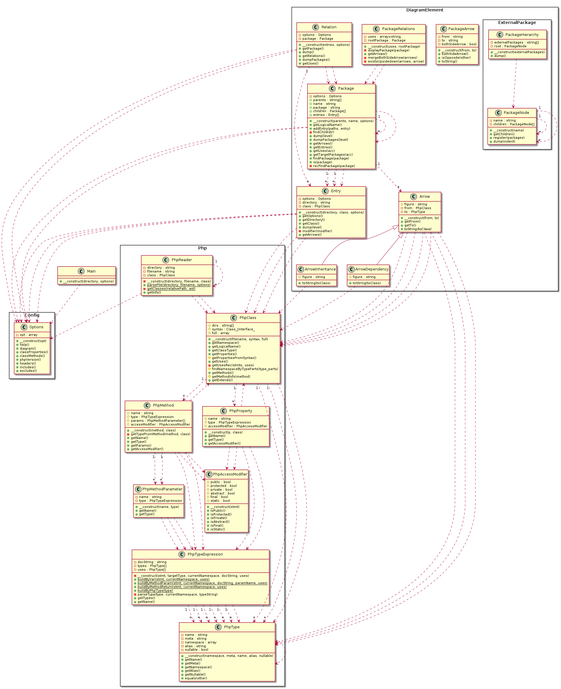
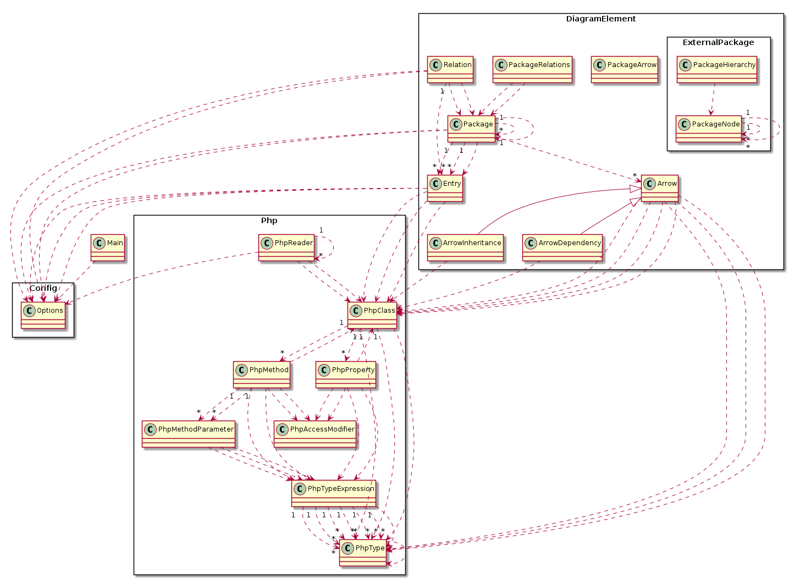
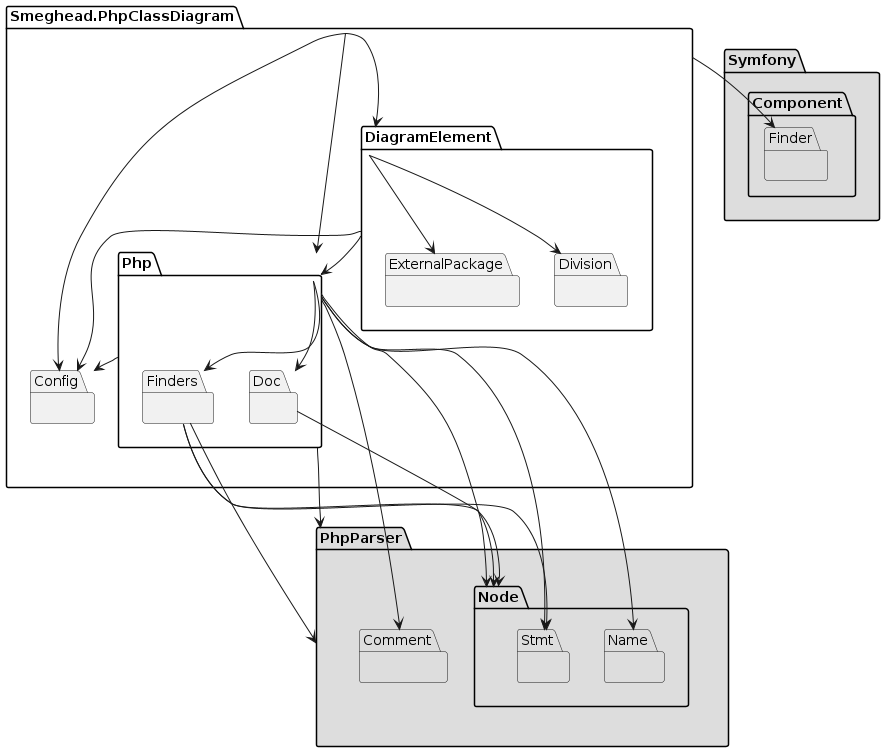
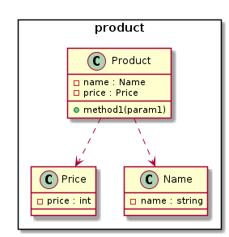

# php-class-diagram

A CLI tool that parses the PHP source directory and outputs PlantUML class diagram scripts.

 [](https://packagist.org/packages/smeghead/php-class-diagram) [](https://packagist.org/packages/smeghead/php-class-diagram) [](https://packagist.org/packages/smeghead/php-class-diagram) [](https://packagist.org/packages/smeghead/php-class-diagram) [](https://packagist.org/packages/smeghead/php-class-diagram)

# Features

 * ♻️ Generating class diagrams from source code helps improve continuous design.
 * 🔖  Generates expressive class diagrams with an emphasis on namespaces and relationships.
 * 🔧 A simple CLI tool that is easy to handle.
 * 💡 It is also possible to output a package relationship diagram that visualizes the dependency on the external namespace.

### php-class-diagram class diagram



### php-class-diagram class diagram without fields and methods

If your analysis focuses on the relationships between classes, the simpler notation may be more suitable.



### php-class-diagram package related diagram

Visualizing package relationships may expose critical design issues.



## Install

### From DockerHub

You can use docker image includes php-class-diagram and plantuml, from below URL.

 * https://hub.docker.com/r/smeghead7/php-class-diagram

### From Composer

```bash
$ mkdir sample
$ cd sample
$ composer init
$ composer require --dev smeghead/php-class-diagram
```

you can execute `./vendor/bin/php-class-diagram`.
for instance, try to display help message.

```bash
$ vendor/bin/php-class-diagram --help
usage: php-class-diagram [OPTIONS] <target php source directory>

A CLI tool that parses the PHP source directory and outputs PlantUML class diagram scripts.

OPTIONS
  -h, --help                     show this help page.
  -v, --version                  show version.
      --class-diagram            output class diagram script. (default)
      --package-diagram          output package diagram script.
      --jig-diagram              output class diagram and package diagram script.
      --enable-class-properties  describe properties in class diagram. (default)
      --disable-class-properties not describe properties in class diagram.
      --enable-class-methods     describe methods in class diagram. (default)
      --disable-class-methods    not describe methods in class diagram.
      --php5                     parse php source file as php5.
      --php7                     parse php source file as php7.
      --php8                     parse php source file as php8. (not suppoted)
      --header='header string'   additional header string. You can specify multiple header values.
      --include='wildcard'       include target file pattern. (default: `*.php`) You can specify multiple include patterns.
      --exclude='wildcard'       exclude target file pattern. You can specify multiple exclude patterns.
```

## How to execute

### Class Diagram

When three php source files that TYPE commented exist in `test/fixtures/no-namespace`,

 * php source files.

```
└─test
    └─fixtures
        └─no-namespace
            └─product
                    Product.php
                    Name.php
                    Price.php
```

 * Product.php
```php
<?php
class Product {
    /** @var Name   product name. */
    private $name;
    /** @var Price  price of product. */
    private $price;
}
```

 * Name.php
```php
<?php
class Name {
    /** @var string  name. */
    private $name;
}
```

 * Price.php
```php
<?php
class Price {
    /** @var int  price. */
    private int $price;
}
```

To execute `php-class-diagram` will print PlantUML script.

```bash
$ vendor/bin/php-class-diagram test/fixtures/no-namespace
@startuml class-diagram
  package product as product <<Rectangle>> {
    class product.Price {
      -price : int
    }
    class product.Name {
      -name : string
    }
    class product.Product {
      -name : Name
      -price : Price
      +method1(param1)
    }
  }
  product.Product ..> product.Name
  product.Product ..> product.Price
@enduml
```

Use PlnatUML to convert the PlantUML script to an image.




#### option `header`

You can specify the string to be output to the PlantUML header.

```bash
$ vendor/bin/php-class-diagram \
    --header='title "This is the class diagram"' \
    path/to/src
```

#### option `include`

You can add patterns to find target files to process.

```bash
$ vendor/bin/php-class-diagram \
    --include='*.php' \
    --include='*.php4' \
    path/to/src
```

#### option `exclude`

You can specify patterns to exclude files from being processed.

```bash
$ vendor/bin/php-class-diagram \
    --exclude='test' \
    --exclude='*Exception.php' \
    path/to/src
```

### Package Diagram

You can visualize package dependencies by creating a package relationship diagram with php-class-diagram.

```bash
$ vendor/bin/php-class-diagram --package-diagram test/fixtures/dependency-loops
@startuml package-related-diagram
  package hoge.fuga as ROOT {
    package product as product {
      package attribute as product.attribute {
      }
      package config as product.config {
      }
    }
  }
  product --> product.attribute
  product <-[#red,plain,thickness=4]-> product.config
@enduml
```

Packages that depend on each other are not desirable.
If it finds packages that depend on each other, it will warn you with a thick red line.


## Development

### Open shell

```bash
docker-compose build
docker-compose run --rm php_cli bash
```

### install dependencies

```bash
composer install
```

### execute tests

```bash
composer test
```
